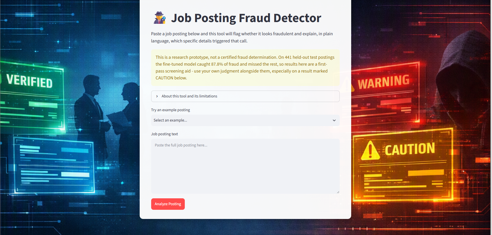

# Verify This Job

A fine-tuned language model that reads a job posting, decides whether it looks fraudulent, and explains the red flags in plain language. Deployed as a Streamlit app with an independent rule-based safety net, so a single bad model call can't wave a scam through.

Live app: [verifythisjob.streamlit.app](https://verifythisjob.streamlit.app)

Model: [TH69426a/emscad-fraud-ft-final](https://huggingface.co/TH69426a/emscad-fraud-ft-final) on Hugging Face Hub



## Why this exists

After losing a 15-year job during COVID, I spent months in a job search where a surprising number of postings were too good to be true. Fake recruiters, pay-to-apply schemes, and "coaching calls" with a fee attached. This project turns that experience into a tool: paste a posting, get a verdict, and see exactly which phrases triggered it.

## How it works

Two independent signals, combined conservatively.

The fine-tuned model is a full fine-tune (no LoRA) of Qwen2.5-0.5B-Instruct, trained on 1,208 labeled postings from the EMSCAD dataset. It returns a structured verdict, a confidence level, and quotes the specific phrases it flagged.

The rule-based safety net is a separate red-flag vocabulary that includes modern scam patterns the 2012 to 2014 training data never saw, such as the consultation-fee coaching grift. If either signal raises a concern, the result escalates to CAUTION. The model can't override the rules and the rules can't override the model.

The app itself is a single Streamlit script that loads the model from Hugging Face Hub, runs inference on the pasted text, applies the rules, and renders the combined result.

## Results

Evaluated on a held-out test split of 441 postings the model never saw during training.

| Metric | Untuned base model | Fine-tuned model |
|---|---|---|
| Format compliance | 0% (all 441 verdicts unparseable) | 100% |
| Fraud recall | n/a | 0.878 |
| Fraud precision | n/a | 0.843 |
| F1 | n/a | 0.860 |
| Accuracy | n/a | 0.905 |
| Fabricated quotes | 71 of 191 | 11 of 82 |

This is a research prototype, not a certified fraud determination. An F1 of 0.860 is solid for a 0.5B model but not production-ready, which is exactly why the rule-based safety net exists. Use the result as a first-pass screen alongside your own judgment.

## Run it locally

```bash
git clone https://github.com/TTHollis/VerifyThisJob.git
cd VerifyThisJob
pip install -r requirements.txt
streamlit run app.py
```

The first run downloads the model (about 2 GB) from Hugging Face Hub. CPU inference works but is slow; a GPU helps.

## Repository layout

```
app.py              Streamlit app: model loading, inference, rule-based safety net, UI
requirements.txt    Python dependencies
assets/             Background images and the app screenshot
docs/               Project milestones from DSC670 (see below)
```

## Project milestones

Built as the term project for DSC670 Advanced Uses of Generative AI at Bellevue University.

- [Milestone 1](docs/Milestone1_HollisT_DSC670.docx): project proposal and problem framing
- [Milestone 2](docs/Milestone2_HollisT_DSC670.ipynb) ([PDF](docs/Milestone2_HollisT_DSC670.pdf)): five prompt-engineering experiments on the base model, which showed that prompting redistributes errors rather than eliminating them
- [Milestone 3](docs/Milestone3_HollisT_DSC670.ipynb) ([PDF](docs/Milestone3_HollisT_DSC670.pdf)): full fine-tune, training metrics, and held-out evaluation
- Milestone 4: this app, plus the rule-based safety net

## Data

Vidros, S., Kolias, C., Kambourakis, G., & Akoglu, L. (2017). Automatic detection of online recruitment frauds: Characteristics, methods, and a public dataset. *Future Internet, 9*(1), 6. https://doi.org/10.3390/fi9010006

## Author

Tim Hollis · [GitHub](https://github.com/TTHollis) · [LinkedIn](https://www.linkedin.com/in/timothy-hollis)
